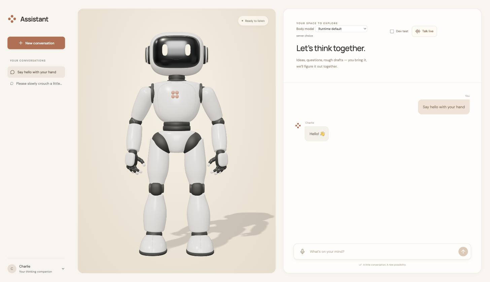

# Avatar Studio

Avatar Studio is a voice assistant with a body. Charlie, a 3D robot, stands
on the left of the screen; you talk to him, type to him, or dictate, and he
answers in speech or text while moving: a wave with a greeting, a
thoughtful lean on a hard question, a run in place if you ask for one. No
animation clips are played. A model writes where his hands, feet, torso and
head should be and when, and the browser solves the joints every frame.

It exists to demonstrate
[assistant-runtime](https://pypi.org/project/assistant-runtime/), an
assistant backend that an application puts behind its own interface, on a
task that needs two models at once: one that talks and one that moves. It is
the sibling of [design-studio](https://github.com/eandualem/design-studio),
built the same way: one page, no accounts, no database, about 6,500 lines of
TypeScript.



> **Experiment branch.** `experiment/jev-body` tries a different strategy
> for the live body: TypeSafe's Jev decision model chooses continuously from
> a library of authored movements, and the number-writing planner only
> composes what the library lacks, growing it. `main` keeps the original
> design. See [docs/expression.md](docs/expression.md).

## What it demonstrates

- **Host tools with numbers, not names.** The assistant has three tools the
  app declares: `move_avatar` (up to 16 timed waypoints for hands, fingers,
  feet, pelvis, torso, shoulders and head, with repeat cycles for rhythmic
  motion), `get_pose` and `capture_avatar`. The app validates each call,
  runs it through an IK solver with joint limits, collision and support
  checks, and returns a receipt with the actual pose and whatever
  constrained it. See [docs/motion.md](docs/motion.md).
- **A decision model on the live body.** *Talk live* puts GPT-Live on the
  conversation over WebRTC. On every transcript change, yours or Charlie's,
  one Jev call answers five typed questions in under half a second: is this
  a movement request, start something now, which library entry, stop, how
  much energy. Code admits at most one movement, and a request the library
  cannot serve goes to the planner on the model you pick in the header; its
  plan is learned into the library. Speech never waits for the body; the
  app owns admission, cancellation and the quiet facts that tell the voice
  when movement really started. See [docs/expression.md](docs/expression.md)
  and [docs/voice.md](docs/voice.md).
- **Host context.** Every request carries the actual pose, the coordinate
  system and the tool schemas, so the model composes from what is true now.
- **Continuations and cancellation.** A tool call pauses the assistant's
  turn; the app performs it and resumes the same message with the receipt.
  Stop interrupts the motion and the request, and a late reply cannot move
  the body afterwards.
- **Vision on itself.** Ask Charlie how a pose looks: he captures the
  canvas and inspects the image with the runtime's `look_at_screen`.
- **Per-request configuration.** The registered profile, model choices and
  the Live persona travel with each request, so one plainly started runtime
  serves this app beside others.

## Running it

You need [bun](https://bun.sh), a way to install a Python command line tool
([uv](https://docs.astral.sh/uv/) or pip), and an `OPENAI_API_KEY`. Text,
body planning and voice all default to OpenAI models, so one key is enough;
other providers work for the body model if you add their keys.

The runtime is a separate process. Install it once and run it beside the
studio.

**Terminal 1, the runtime:**

```bash
uv tool install 'assistant-runtime[voice]==0.2.0'   # or: pip install 'assistant-runtime[voice]==0.2.0'

export OPENAI_API_KEY=sk-...                  # the runtime also reads a .env in the directory you run it in
export VOICE__ENABLED=true                    # GPT-Live audio; bills connected time

# register this app's profile, the prompt artifacts that make the runtime Charlie.
# The path must be absolute; `echo "$PWD/profiles/avatar-studio.toml"` in this
# repository prints it. One runtime can register several apps' profiles.
export ASSISTANT__PROFILES='["/absolute/path/to/avatar-studio/profiles/avatar-studio.toml"]'

assistant-runtime serve --port 7100
```

**Terminal 2, the studio:**

```bash
git clone https://github.com/eandualem/avatar-studio
cd avatar-studio
bun install
make dev
```

Open <http://127.0.0.1:7140>. Type *"Wave at me"* and Charlie waves; ask
*"How does your pose look?"* and he takes a look at himself.

`make dev` checks the runtime first and exits with one line saying what to
do if it is not reachable, has no `avatar_studio` profile registered, or is
older than 0.2.0 (registered profiles and per-call Live instructions). It
never starts or stops the runtime. The studio talks to
`http://127.0.0.1:7100`; `RUNTIME_URL` in `.env.local` points elsewhere,
`TYPESAFE_API_KEY` there enables the Jev expression loop during calls, and
`.env.example` lists the other server-side settings (which model plans text
and which plans movement). Conversations are kept in your browser; the
runtime's memory of them lasts as long as the runtime process unless you
give it Postgres.

### Talking to him

Press **Talk live**, allow the microphone, and talk. Charlie answers in
speech and his body follows the conversation; **Stop movement** freezes him
without ending the call, the microphone button mutes you, **End call** hangs
up. The **Body model** control in the header picks which model plans the
movement; the fast ones are listed with the key they need.
`make check` runs the tests, typecheck, lint and build.

## Using it

Charlie stands in the left pane; the conversation is on the right. The
composer takes typed text, or dictation through the browser's speech
recognition (**Dictate a message**; it only fills the box, you still press
Send). **New conversation** starts a fresh one; earlier ones are in the list.
**Dev test** opens a panel for driving the body by hand: pick an example
such as *Small wave* or *Run in place*, edit the numbers or the raw JSON,
run it, read the receipt. It is the fastest way to see what the solver
allows.

## How it is built

Next.js, Three.js and XState, in four layers that do not reach past each
other: components render props, hooks expose `{ state, data, actions }`,
machines hold every transition and side effect, and `lib/` is pure
functions and clients.

| Directory | What lives there |
|---|---|
| `machines/` | `appMachine` (root), `avatarMachine`, `conversationMachine`, `speechMachine`, `voiceMachine` |
| `hooks/` | `useStudio`, the bridge between machines and components |
| `components/` | `Studio`, `MotionLab` (the Dev panel), the Body model control, timing rows |
| `lib/` | the renderer, the IK adapter and collision checks (`body/`), interpolation, host tools, the runtime, voice and Jev clients, the expression controller and the gesture library |
| `types/` | Zod schemas for every wire shape |
| `profiles/` | the assistant profile, the two prompts and the movement skill |
| `blender/` | the Python that builds and rigs Charlie; `rigged.blend` is the source of the GLB |

The interesting files are `lib/expression-controller.ts`, where Jev's
answers become admitted, cancelled or superseded movements,
`lib/gesture-library.ts`, the authored movements Jev chooses from, and
`lib/motion.ts`, where a plan becomes per-frame joint targets under rate
limits.
[docs/architecture.md](docs/architecture.md) is the map;
[blender/README.md](blender/README.md) rebuilds the character.

```bash
bun run lint && bun run test && bun run build
```

Contributor notes are in [AGENTS.md](AGENTS.md).

## License

MIT, see [LICENSE](LICENSE). The IK solver
([closed-chain-ik-js](https://github.com/gkjohnson/closed-chain-ik-js)) and
[Rapier](https://rapier.rs) are Apache-2.0.
