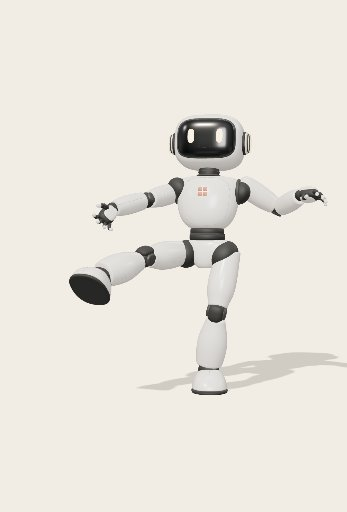
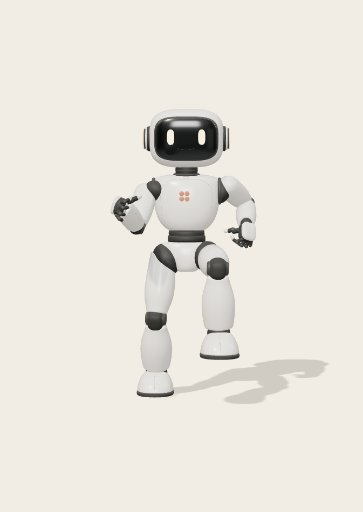
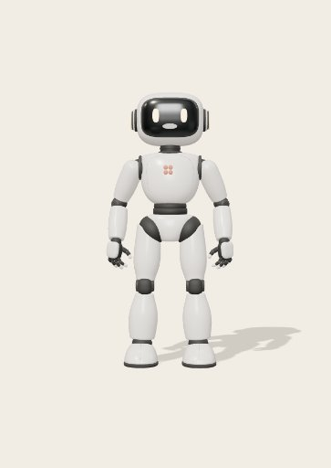

# Direct movement testing

Enable **Dev test** next to **Talk live** when chat is idle and no live call is
active. It replaces the conversation area while keeping Charlie visible. Choose
an example, edit numeric fields (applied when leaving the field), or edit the
full `move_avatar` argument JSON. Loading or editing an example never moves the
body. **Run movement** calls the same `executeTool` validator and motion
controller as text/live actions, with no model or runtime request.

**Stop** holds the current pose and keeps an interrupted receipt. **Read pose**
calls `get_pose`. **Reset pose** immediately stops any running test and restores
the validated initial standing pose, bone transforms, joint solver values and
velocities, and wrist state. It works after blocked movements without reloading
and leaves your edited inputs intact. It is a local test control, not an agent
tool or an animated path back to standing. The receipt records `status: reset`.
**Capture avatar** takes a fresh image of only the rendered robot and shows it
below the controls. It does not contact a model. **Return to rest** remains an editable animated example through the solver. Closing Dev test stops ongoing
movement and restores the conversation. Draft inputs and the last completed
receipt survive toggling within the page; reload clears them. Chat, live setup,
dictation and conversation navigation cannot take ownership during a test.

The public API exposes hand/ankle targets, fingers, pelvis, torso, shoulders and
head. It does not give the model unrestricted access to every skeleton joint.
The solver chooses bounded arm/leg joint rotations. The expandable tool schema
shows all supported fields and ranges. X is robot left, Y up, Z forward, height
is 1, and angles are radians. Waypoint times are cumulative. Omitted fields hold
their previous targets within a sequence; new calls begin at the actual pose.

## Reading results

The preview uses the last read pose; it updates after execution or **Read pose**.
The **last execution receipt** belongs to its recorded input, even if the editor
has since changed. A reset replaces it with a reset receipt. **Copy report** includes that input, starting pose, full tool
receipt and local call elapsed time. Reports are local and are not uploaded.

- Requested duration is the last input waypoint time. Planned duration includes
  the existing Cartesian/channel speed extensions. Both are recomputed at actual
  execution, so the receipt is authoritative for that run.
- Actual execution includes settling. The controller can wait up to three extra
  seconds after the plan. Small frame-boundary overshoot also appears as extra
  settling; this is not an exact measure of time spent correcting the pose.
- First motion frame measures local request-to-first-RAF scheduling, not first
  visible displacement, speech-to-action time or model inference.
- Gaps over 50ms and the largest frame gap help identify scheduling stalls.
  Background tabs, browser load and rendering can all affect them.
- Solver mean/peak measures interpolation plus applying the pose, excluding
  rendering. It is a local diagnostic, not an end-to-end frame budget.
- `completed` means execution ended. Check `constrained`, `reasons` and actual
  pose before deciding the requested target was reached. Speed extension,
  wrist limits, collision/support rejection and incomplete settling are separate
  reasons. No constraint has been relaxed for Dev test.

For comparisons, use **Reset pose** to establish the same starting pose, then run identical
inputs and change one variable at a time. Compare a short head change with a
full arm raise. A small requested time cannot override the speed ceiling. The
current quintic interpolation eases to zero velocity at every waypoint, so
adding many tiny points can introduce visible pauses even with steady frames.
Collision rejection restores the last accepted pose and does not plan a route
around an obstacle. These are system behaviors; better model guidance alone
cannot remove them.

## Guidance reaching Charlie

`profiles/skills/charlie-motion/SKILL.md` is the maintained movement guide. It is
bundled as text into `host_context.view.data.movement_skill`, alongside the
current pose, schema and landmarks. Existing runtime instances receive it with
new text requests, new live calls and subsequent host-context PATCHes; it does
not modify a model turn already in progress. No filesystem skill discovery or
runtime restart is needed for this backend contextual guidance. It is not a
replacement for the runtime profile policy.

The guide recommends early composition of one coordinated sequence, avoiding
unnecessary `get_pose` calls, small expressive excursions, and adapting to actual
constraint results. Its examples are starting points, not an agent-side gesture
menu or globally optimal speed settings. They correspond to the editable test
examples. Skill frontmatter was validated and the real skeleton tests exercise
the examples; improved model behavior still requires a comparative live trial.

## Live latency and concurrency

Assistant-runtime's agent reviewed the current contract and source at develop
`dd729be` on September 14. Speech/listening and delegated backend work can overlap.
The bridge queues delegation immediately on receipt; our `VoiceClient.perform`
has no speech-ended gate. Multiple body channels can move together in one tool
call. Host calls themselves are handed off sequentially, and a newer delegation
supersedes unfinished older work after cancellation cleanup. Spoken interruption
alone does not cancel movement.

The critical path is Live deciding to delegate, backend composition, pending
host delivery, local movement, host-context PATCH, tool-result submission and
backend continuation. Audio remains live while the host executes. Completion
commentary comes after the result and continuation; the runtime does not send
automatic pending-host commentary or forward backend text deltas into Live.
An HTTP acknowledgement or accepted result is not proof of audible speech.

The revised `profiles/live-instructions.md` encourages prompt delegation and a
brief acknowledgement while work runs. It was loaded when the dedicated voice
runtime on 7110 was started with screen support on September 14.
`VOICE__INSTRUCTIONS` is frozen at service startup; editing the file or PATCHing
host context does not activate it. Backend movement/visual guidance in host
context updates without restarting the runtime.

Direct-test receipts do not measure delegation/backend latency. In a subsequent
live investigation, correlate delegation/tool IDs and locally timestamp backend
`final_response` containing a pending call versus delegation `pending_host` to
isolate stream-drain work, then execution, context PATCH and result POST. The
runtime agent identified memory extraction during stream teardown as one
possible tail, but no run established it as the cause of Elias's observed delay.
Do not retry physical motion because a result acknowledgement is slow.

## Shorter default timings

Following Elias’s browser trial, all six examples now request one third of
their original waypoint times: head glance 0.2/0.4s, hand raise 0.6s, wave
0.6/0.7333/0.8667/1.0s, fingers 0.3333s, crouch 0.5s, and animated return
0.6667s. Matching profile and movement-skill guidance uses the shorter requests.
Solver speed limits and settling deadlines are unchanged; compare requested and
planned times in the receipt. These are requested durations, not a promise that
a full reach finishes three times faster.

## Verification, September 14

The six examples ran against the exported GLB at their planned 60Hz timing,
checking collision/support each frame and final hand/pelvis/head targets. Actor
tests cover direct execution without network requests, duplicate clicks,
exclusive ownership, invalid inputs, pose reads, stop, close and late results.
Motion tests cover speed extension and frame timing. The 55 tests, TypeScript,
ESLint and production build passed before browser verification.

In the original PR #15 foreground desktop Chrome trial, a requested 1.20s head glance took 1.21s,
with a 28ms first frame, no gaps over 50ms and 1.1ms mean pose-application time.
A requested 3.00s wave planned 3.16s and took 3.18s, with a 39ms first frame,
no gaps over 50ms and 1.4ms mean pose-application time. The wave reported speed
extension and wrist swing limiting. These are single local samples, not a
benchmark or evidence that every trajectory is smooth. Browser checks also
covered negative/out-of-range numeric edits, stop receipts, return to rest,
desktop and 390×844 layouts. No new paid live audio session was started.

The reset follow-up passes 58 tests, TypeScript, ESLint and production build.
Tests cover restoring a blocked rig and solver state, preventing cancelled
frames and late results from overwriting reset, and starting a fresh movement
from the reset pose. All six shortened examples still pass real-skeleton tests.
Browser verification checks reset during a hand raise, after a blocked target,
preserved JSON edits, and the 0.6s hand-raise default.

## Why 0.6s and 0.2s can look identical

The planner takes the maximum of the requested segment time and each channel's
minimum time. Its quintic easing has a peak speed multiplier of 1.875. For the
hand-raise example from reset, the hand direction turns through π radians at a
3 rad/s limit: π × 1.875 / 3 = **1.9635 seconds**. Hand travel also imposes a
minimum. Both 0.6s and 0.2s are below these floors and produce the same plan.
Joint-rate limits and up to three seconds of settling can extend actual motion
further. The preview now names each limiting channel; execution receipts record
per-segment requested/planned seconds and channel minimums in `timing.segments`.
These diagnostics do not change the limits. Faster full-range movement requires
measured solver/rate tuning; smaller movements can finish sooner.

## Fresh visual feedback and a kicking stance

The app previously sent numeric poses but no image. `look_at_screen` could not
inspect the avatar without one. The renderer now captures a fresh frame directly
from the avatar canvas, at most 512px, without chat, desktop or camera video.
A synchronous render before readback avoids blank frames without enabling
`preserveDrawingBuffer`. A capture failure is explicit and sends no cached image.

New text turns, tool continuations, voice creation and full voice-context PATCHes
carry one canonical `host_context.attachments` screenshot. The runtime's built-in
`look_at_screen` exposes it on demand. `capture_avatar` also allows the backend to
request a fresh frame; its result contains an image and actual pose. Context is
refreshed before returning a voice tool result, since the runtime prefers the
context screenshot to a nested result screenshot. GPT-Live delegates inspection
to the backend; it does not receive a live visual stream. Setup instructions now
enable `TOOLS__BUILTIN_TOOLS='["time","screen"]'`.

Choose **Kicking stance** after **Reset pose**. It shifts weight over the left
foot, lifts the right knee and extends the leg diagonally forward while extending
the left arm. The diagonal target improves readability from the approved frontal
camera. It is a held stance with static support checks, not a dynamic strike.
The editable example and movement skill use the same targets.

In the exported-rig 60Hz probe, the raised ankle reached roughly 0.424 normalized
height and 0.250 forward; the knee retained about 0.214 radians of flexion. The
left sole stayed planted, the right sole stayed clear, and collision/support
checks passed every frame. Wrist and right-side joint constraints still appear
in the receipt: the solver does not exactly reach every requested foot angle.

Real text trials recorded `capture_avatar` followed by `look_at_screen` and
correctly distinguished standing from a changed kicking pose. The model also
misread the first, more frontal kick as a strongly bent knee despite the numeric
joint measurement showing near extension. Visual feedback is useful evidence,
not infallible anatomy measurement; this prompted the clearer diagonal example.
Transport tests verify fresh images on text continuation and voice PATCH-before-
result ordering, capture failure and cancellation. No paid voice call was started
for this follow-up; live audio visual inspection still needs a user trial.

The dedicated voice runtime on 7110 is healthy with `look_at_screen` enabled and
zero calls at setup. Its launcher update unexpectedly triggered the broad Python
reloader on text runtime 7100 at 10:53:39 local time. The runtime agent reported
this incident; prior in-memory histories cannot be verified as surviving, while
browser-held transcripts remain. Both services recovered and text vision was
verified afterward. Avoid editing Python launchers inside a watched runtime tree.

This follow-up passes 62 tests, TypeScript, ESLint, skill validation and the
production build. Browser checks confirm identical 1.96s plans for 0.6s and 0.2s
hand raises, fresh canvas images, a clearer diagonal kick, and controls/capture
without horizontal overflow at 390×844. The committed image is from the actual
browser renderer with the final example targets.

## Repeated cycles and running in place (issue #22)

`move_avatar` now accepts `prepare`, `waypoints`, `repeat`, `finish`, `mode` and
`interpolation`. `repeat` is the **total** cycle count (1–20, default 1). Preparation
and finish run once. Times increase independently within each array, starting
from zero; each array allows 1–16 points and a last requested time up to 20s.
The full plan, including speed extensions and all repeats, must fit 40s, plus up
to 3s settling. There is no unlimited background loop. Stop, cancellation, reset,
a newer action and closing Dev test interrupt the entire sequence; finish is
skipped on interruption. The next action starts from the actual held pose.

Cycle targets omitted from input are resolved once from the prepared pose.
They do not accumulate changes across repetitions. End a cycle at its starting
pose for a clean seam. `interpolation:"swing"` uses cosine half-waves for rhythmic
reversals, with peak speed factor π/2; the default quintic remains unchanged.
Swing is suited to opposing extremes, not a general path spline. It does not
promise continuous velocity/acceleration through arbitrary unequal segments.
Receipts include `cycles.requested` and `cycles.elapsed`; elapsed counts fully
elapsed cycle plans, not verified contact events or successfully reached targets.

Default `mode:"grounded"` preserves standing support and existing rates.
`mode:"animated"` permits unsupported/flight poses and increases bounded limb
rates: joints 8 rad/s with 40 rad/s² velocity slew (grounded: 2.1 and 10), hand/foot
travel 1.2 height/s, foot angles 2 rad/s, pelvis translation 0.5 height/s and torso
1.5 rad/s. Other channel limits remain unchanged. Bone lengths, joint ranges,
wrist restrictions, simplified collision and sole-floor rejection remain active.
An upstream singular-chain exception now restores the previous frame and reports
an unresolved target, rather than leaving the motion promise hanging.

This is procedural animation without gravity, momentum, root travel or foot
locking. Running in place is stylized; flight is permitted, not physically
simulated. Grounded actions cannot necessarily recover from an interrupted flight
pose: lower both feet with animated mode or use Dev test Reset pose.

Dev test includes **Clap five times**, **Run in place**, a repeat-count field and
an editor selector for preparation/cycle/finish. Both examples prepare once,
repeat a complete cycle and return to standing. The run uses opposite arms and
legs; one cycle includes both alternating steps. The clap closes/opens the hands
with clearance; it does not simulate impact or make a clapping sound. All targets
remain editable and are exposed through the existing generic tool, not named
agent gestures. The maintained host movement skill includes the tested examples.

## Speaking mouth

A small ivory opening overlays the etched smile and follows the Head bone. The
approved exported model is unchanged. Outgoing remote audio amplitude drives
opening with 35ms attack/75ms release smoothing, independently of body actions.
Silence, blocked/paused/muted playback and call shutdown close it. Microphone
input and text responses do not drive it; this is not phoneme lip-sync.
Dev test's **Mouth opening (preview)** slider previews it without audio or a
provider call. Leaving Dev test closes the preview before live voice takes over.

Backend profile instructions can be updated through the public versioned
instructions artifact without restarting 7112, affecting subsequent backend
requests in existing and new sessions. Host schemas and movement skill also
update inline. The separate Live prompt remains frozen until startup: revised
`profiles/live-instructions.md` applies on the next coordinated runtime launch.
The current audio prompt's old claim about having no animated lips does not gate
host mouth playback. Preserve existing runtime processes and their histories.

## Demo-pass verification, September 14

The 70 tests cover every repeated reversal on the exported skeleton, drift,
floor/collision and joint-rate bounds, old grounded behavior, exact cycle counts,
interruption/reset, mouth attachment and blocked/paused/silent/ended audio.
TypeScript, ESLint, skill validation and production build pass.

Browser checks covered a 20-cycle run (19.60s, 1,176 frames, no gaps over 50ms),
five clap cycles (7.43s, 446 frames, no gaps over 50ms), interruption, reset,
preparation/cycle editing, mouth open/closed preview and 390×844 layout without
horizontal overflow. These are local samples, not end-to-end latency benchmarks.
The clap and run receipts retain wrist-swing limiting; their positional cycles
pass the real-rig tests. Images below are actual avatar canvas captures: a held
run-cycle extreme and the fully open mouth preview.

A new subscription-backed text session `9617addf-a24d-4fee-878b-39a92f8a3736`
received “Run in place for four cycles, then return to standing.” Its single
`move_avatar` call used animated/swing, repeat 4, preparation and finish. The
saved receipt records 4 elapsed cycles, 5.20s planned / 5.213s actual, 313 frames,
no slow frames, 27.5ms first frame and 1.09ms mean apply time. It returned to
standing and the final response acknowledged the wrist restriction. No new paid
Live call was allocated; mouth audio behavior was verified with synthetic remote
media and real rendered preview, and awaits Elias's next real voice trial.

7112's public instructions artifact PATCH returned HTTP 200, version 1,
`effective_on_next_request:true`, `durable:false`; reread matched the revised
profile after whitespace normalization. The original processes, subscription
model/auth settings and histories were preserved. No automated review comments
were present on PR #23 at final review. GitHub's application job could not start
because of account billing/spending limits (job 103939877609); no required checks
were reported. Local checks provide the available verification.
